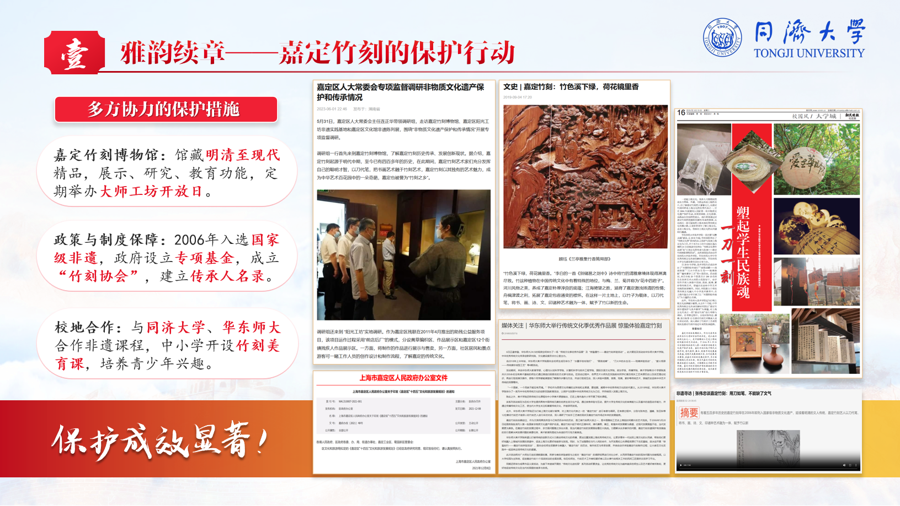

  

<h1>TJCS  Slides</h1>
  

  
  

  

    <h3>思政类 slides 指南</h3>

## Principle

- 这里的素材适用于思政课的 presentation 以及主题介绍
- 当然，对于思政课的汇报来说，通常做好 silides 是不够的，我建议补充一些视频、问卷数据等
- 这里的素材并非个人制作，而是从各个渠道收集的

## 素材

- 请先安装所有字体 [[字体](https://drive.google.com/drive/folders/15CzqHn5-n6EvtAL2uylb49pPHXqho_I1?usp=drive_link)]
- 这里有一些非常实用的素材，对于素材，我建议在制作 slides 时选择性复制需要的元素 [[文件夹](https://drive.google.com/drive/folders/1pBSbC43S4dQujHOjzlJoCWjV0JKUzi1-?usp=drive_link)]
  - 优先选择 [[素材](https://docs.google.com/presentation/d/1ehqTJ-xkxLPM_rJhd8BSrNfZ2aHlq_g7/edit?usp=drive_link&ouid=108805123057098880640&rtpof=true&sd=true)]
  - 个人答辩 [[素材](https://docs.google.com/presentation/d/1aDwNfr8IK3GEMGw4_fTcgaoeHe_XJjoX/edit?usp=drive_link&ouid=108805123057098880640&rtpof=true&sd=true)]
  - 红色背景 [[素材](https://docs.google.com/presentation/d/1vYpRBGr_5LEJxZjaJ5V1hQZ2VN9U_6cl/edit?usp=drive_link&ouid=108805123057098880640&rtpof=true&sd=true)]

## Example

---

