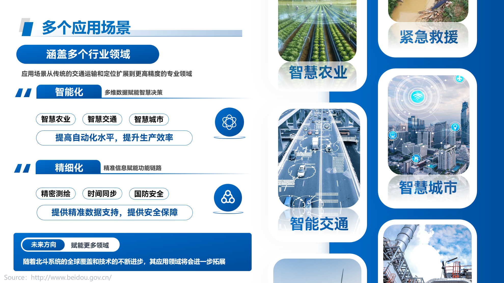
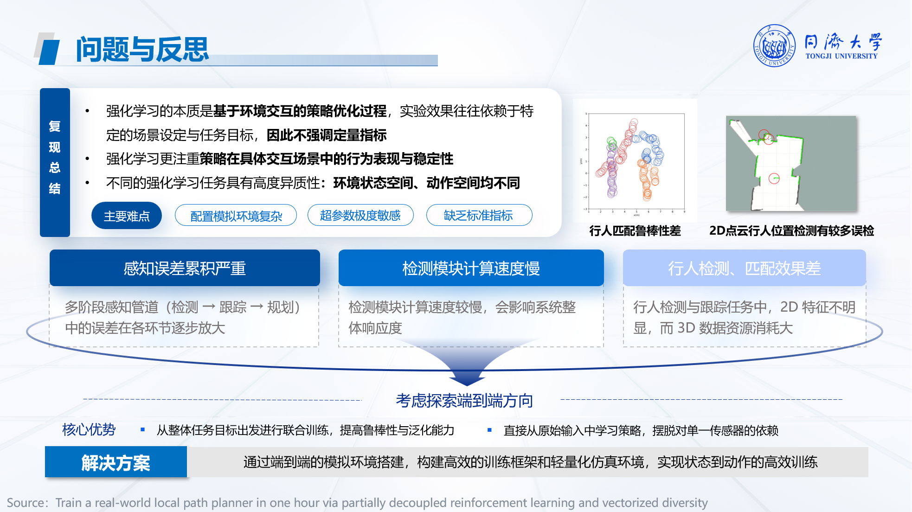
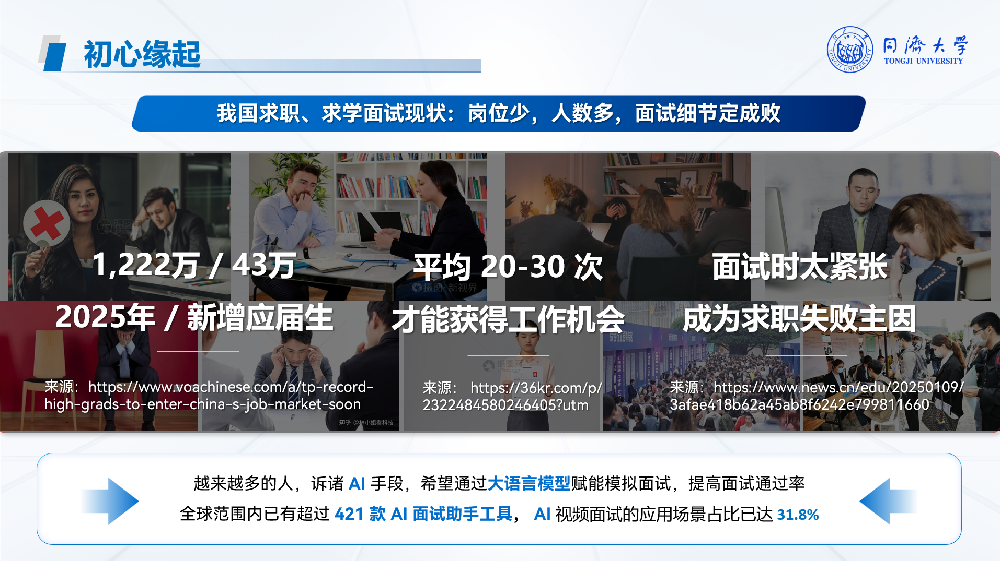

  

<h1>TJCS  Slides</h1>
  

  
  

  

    <h3>科技、技术类 slides 指南</h3>

## Principle

- 这里展示的素材，与科研场合（eg., 组会）并不匹配，**<u>不建议</u>**在任何科研相关场合下使用本素材
- 这里的素材适用于在本科阶段任何有关科技、专业知识相关的 slides 中
- 这里的素材并非个人制作，而是从各个渠道收集的

## 素材

- 请先安装所有字体 [[字体](https://drive.google.com/drive/folders/18q9V7gxqdVR3f2dN--mgEHfsIR-WIIwz?usp=drive_link)]
- 这里有一些非常实用的素材，对于素材，我建议在制作 slides 时选择性复制需要的元素 [[文件夹](https://drive.google.com/drive/folders/1Vp1bONznagewof5tLgKmkspYFGljqkgx?usp=drive_link)]
  - ML visual [[素材](https://docs.google.com/presentation/d/1H8jUqY9ciasWqAJS5GTlYceKKTHVlthu/edit?usp=drive_link&ouid=108805123057098880640&rtpof=true&sd=true)]
  - 年终工作总结 [[素材](https://docs.google.com/presentation/d/1HzXa21RD6owdvHQjXmbc6mePfVWU6SPX/edit?usp=drive_link&ouid=108805123057098880640&rtpof=true&sd=true)]
  - 企业宣传 [[素材](https://docs.google.com/presentation/d/1GYnMYX1Bp0gR5vWMVNCJQvBwg71_NNq6/edit?usp=drive_link&ouid=108805123057098880640&rtpof=true&sd=true)]

## Example

---

---

